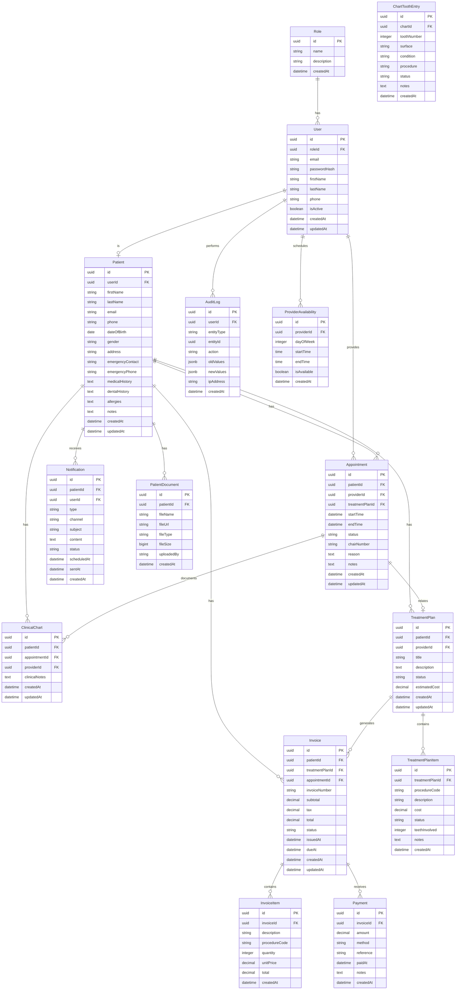

# SmileFlow - Step 1: Planning Output

## 1. Final Folder Structure

```
smileflow/
├── apps/
│   ├── web/                          # Next.js frontend
│   │   ├── public/
│   │   ├── src/
│   │   │   ├── app/                  # App Router pages
│   │   │   │   ├── (auth)/           # Auth route group
│   │   │   │   │   ├── login/
│   │   │   │   │   └── register/
│   │   │   │   ├── (staff)/          # Staff dashboard group
│   │   │   │   │   ├── layout.tsx
│   │   │   │   │   ├── dashboard/
│   │   │   │   │   ├── patients/
│   │   │   │   │   │   ├── [id]/
│   │   │   │   │   │   └── new/
│   │   │   │   │   ├── appointments/
│   │   │   │   │   ├── charting/
│   │   │   │   │   │   └── [patientId]/
│   │   │   │   │   ├── treatment-plans/
│   │   │   │   │   │   └── [id]/
│   │   │   │   │   ├── billing/
│   │   │   │   │   │   ├── invoices/
│   │   │   │   │   │   │   └── [id]/
│   │   │   │   │   │   └── payments/
│   │   │   │   │   ├── reports/
│   │   │   │   │   └── settings/
│   │   │   │   ├── (portal)/         # Patient portal group
│   │   │   │   │   ├── layout.tsx
│   │   │   │   │   ├── portal/
│   │   │   │   │   ├── portal/book/
│   │   │   │   │   ├── portal/appointments/
│   │   │   │   │   ├── portal/invoices/
│   │   │   │   │   ├── portal/treatments/
│   │   │   │   │   └── portal/profile/
│   │   │   │   ├── layout.tsx        # Root layout
│   │   │   │   ├── page.tsx          # Landing/redirect
│   │   │   │   └── globals.css
│   │   │   ├── components/
│   │   │   │   ├── ui/               # Shared UI components
│   │   │   │   ├── forms/            # Form components
│   │   │   │   ├── dashboard/        # Dashboard widgets
│   │   │   │   ├── patients/         # Patient-related
│   │   │   │   ├── appointments/     # Appointment-related
│   │   │   │   ├── charting/         # Dental charting
│   │   │   │   ├── billing/          # Billing-related
│   │   │   │   └── portal/           # Patient portal
│   │   │   ├── hooks/                # Custom React hooks
│   │   │   ├── lib/                  # Utilities and API client
│   │   │   ├── types/                # TypeScript types
│   │   │   └── providers/            # Context providers
│   │   ├── tests/                    # Frontend tests
│   │   ├── docker/
│   │   │   └── Dockerfile
│   │   ├── .env.example
│   │   ├── .env.local
│   │   ├── next.config.ts
│   │   ├── tailwind.config.ts
│   │   ├── tsconfig.json
│   │   ├── package.json
│   │   └── playwright.config.ts
│   │
│   └── api/                          # NestJS backend
│       ├── src/
│       │   ├── main.ts
│       │   ├── app.module.ts
│       │   ├── common/               # Shared utilities
│       │   │   ├── guards/
│       │   │   │   ├── jwt-auth.guard.ts
│       │   │   │   └── roles.guard.ts
│       │   │   ├── decorators/
│       │   │   │   ├── roles.decorator.ts
│       │   │   │   └── current-user.decorator.ts
│       │   │   ├── interceptors/
│       │   │   │   └── audit.interceptor.ts
│       │   │   ├── filters/
│       │   │   │   └── global-exception.filter.ts
│       │   │   └── dto/
│       │   │       └── pagination.dto.ts
│       │   ├── modules/
│       │   │   ├── auth/
│       │   │   │   ├── auth.module.ts
│       │   │   │   ├── auth.controller.ts
│       │   │   │   ├── auth.service.ts
│       │   │   │   ├── strategies/
│       │   │   │   │   ├── jwt.strategy.ts
│       │   │   │   │   └── local.strategy.ts
│       │   │   │   └── dto/
│       │   │   │       ├── login.dto.ts
│       │   │   │       └── register.dto.ts
│       │   │   ├── users/
│       │   │   │   ├── users.module.ts
│       │   │   │   ├── users.controller.ts
│       │   │   │   ├── users.service.ts
│       │   │   │   └── dto/
│       │   │   ├── patients/
│       │   │   │   ├── patients.module.ts
│       │   │   │   ├── patients.controller.ts
│       │   │   │   ├── patients.service.ts
│       │   │   │   └── dto/
│       │   │   ├── appointments/
│       │   │   │   ├── appointments.module.ts
│       │   │   │   ├── appointments.controller.ts
│       │   │   │   ├── appointments.service.ts
│       │   │   │   └── dto/
│       │   │   ├── charting/
│       │   │   │   ├── charting.module.ts
│       │   │   │   ├── charting.controller.ts
│       │   │   │   ├── charting.service.ts
│       │   │   │   └── dto/
│       │   │   ├── treatment-plans/
│       │   │   │   ├── treatment-plans.module.ts
│       │   │   │   ├── treatment-plans.controller.ts
│       │   │   │   ├── treatment-plans.service.ts
│       │   │   │   └── dto/
│       │   │   ├── billing/
│       │   │   │   ├── billing.module.ts
│       │   │   │   ├── billing.controller.ts
│       │   │   │   ├── billing.service.ts
│       │   │   │   └── dto/
│       │   │   ├── notifications/
│       │   │   │   ├── notifications.module.ts
│       │   │   │   ├── notifications.controller.ts
│       │   │   │   ├── notifications.service.ts
│       │   │   │   └── dto/
│       │   │   ├── reporting/
│       │   │   │   ├── reporting.module.ts
│       │   │   │   ├── reporting.controller.ts
│       │   │   │   └── reporting.service.ts
│       │   │   ├── portal/
│       │   │   │   ├── portal.module.ts
│       │   │   │   ├── portal.controller.ts
│       │   │   │   └── portal.service.ts
│       │   │   └── audit/
│       │   │       ├── audit.module.ts
│       │   │       ├── audit.service.ts
│       │   │       └── audit.controller.ts
│       │   ├── prisma/
│       │   │   ├── prisma.module.ts
│       │   │   └── prisma.service.ts
│       │   └── queue/
│       │       ├── queue.module.ts
│       │       └── queue.service.ts
│       ├── prisma/
│       │   ├── schema.prisma
│       │   ├── migrations/
│       │   └── seed.ts
│       ├── tests/
│       │   ├── auth.spec.ts
│       │   ├── patients.spec.ts
│       │   ├── appointments.spec.ts
│       │   └── billing.spec.ts
│       ├── docker/
│       │   └── Dockerfile
│       ├── .env.example
│       ├── nest-cli.json
│       ├── tsconfig.json
│       ├── tsconfig.build.json
│       └── package.json
│
├── packages/
│   ├── shared-types/
│   │   ├── src/
│   │   │   ├── index.ts
│   │   │   ├── user.types.ts
│   │   │   ├── patient.types.ts
│   │   │   ├── appointment.types.ts
│   │   │   ├── charting.types.ts
│   │   │   ├── treatment.types.ts
│   │   │   ├── billing.types.ts
│   │   │   └── common.types.ts
│   │   ├── package.json
│   │   └── tsconfig.json
│   └── config/
│       ├── src/
│       │   ├── index.ts
│       │   └── env.ts
│       ├── package.json
│       └── tsconfig.json
│
├── docs/
│   ├── PLAN.md                       # This file
│   ├── ER.md                         # ER diagram
│   ├── API.md                        # API documentation
│   └── ARCHITECTURE.md               # Architecture overview
│
├── docker/
│   ├── docker-compose.yml
│   ├── docker-compose.prod.yml
│   └── nginx.conf
│
├── .github/
│   └── workflows/
│       └── ci.yml
│
├── .gitignore
├── .eslintrc.js
├── .prettierrc
├── package.json                      # Root package.json
├── turbo.json
├── README.md
└── .env.example
```

---

## 2. ER Diagram (Markdown)



---

## 3. Backend Module Plan

### Module 1: Auth Module (`/auth`)
- **Purpose:** JWT authentication, login, register, token refresh, password reset
- **Dependencies:** Users module, Prisma, JWT
- **Key Services:** AuthService
- **Guards:** JwtAuthGuard, LocalAuthGuard

### Module 2: Users Module (`/users`)
- **Purpose:** User CRUD, staff management, role assignment
- **Dependencies:** Prisma, Auth module
- **Key Services:** UsersService
- **Guards:** JwtAuthGuard, RolesGuard (admin)

### Module 3: Patients Module (`/patients`)
- **Purpose:** Patient profiles, medical/dental history, documents
- **Dependencies:** Prisma, Auth module
- **Key Services:** PatientsService
- **Guards:** JwtAuthGuard (staff)

### Module 4: Appointments Module (`/appointments`)
- **Purpose:** Scheduling, conflict prevention, status lifecycle
- **Dependencies:** Prisma, Patients, Notifications
- **Key Services:** AppointmentsService
- **Guards:** JwtAuthGuard (staff)

### Module 5: Charting Module (`/charting`)
- **Purpose:** Dental charting, tooth entries, clinical notes
- **Dependencies:** Prisma, Patients, Appointments
- **Key Services:** ChartingService
- **Guards:** JwtAuthGuard (dentist, assistant)

### Module 6: Treatment Plans Module (`/treatment-plans`)
- **Purpose:** Multi-item plans, estimates, status tracking
- **Dependencies:** Prisma, Patients, Appointments
- **Key Services:** TreatmentPlansService
- **Guards:** JwtAuthGuard (dentist)

### Module 7: Billing Module (`/invoices`, `/payments`)
- **Purpose:** Invoice generation, payment recording, balance tracking
- **Dependencies:** Prisma, TreatmentPlans, Patients
- **Key Services:** BillingService
- **Guards:** JwtAuthGuard (receptionist, admin)

### Module 8: Notifications Module (`/notifications`)
- **Purpose:** Reminder scheduling, message history, channel abstraction
- **Dependencies:** Prisma, Queue service
- **Key Services:** NotificationsService
- **Guards:** JwtAuthGuard

### Module 9: Reporting Module (`/reports`)
- **Purpose:** Dashboard KPIs, revenue, appointments, no-shows
- **Dependencies:** Prisma
- **Key Services:** ReportingService
- **Guards:** JwtAuthGuard (admin, dentist)

### Module 10: Portal Module (`/portal`)
- **Purpose:** Patient self-service APIs
- **Dependencies:** Prisma, Patients, Appointments, Billing
- **Key Services:** PortalService
- **Guards:** JwtAuthGuard (patient)

### Module 11: Audit Module (`/audit-logs`)
- **Purpose:** Action logging, compliance tracking
- **Dependencies:** Prisma
- **Key Services:** AuditService
- **Guards:** None (interceptor-based)

---

## 4. Frontend Route Map

### Public Routes
| Route | Component | Description |
|-------|-----------|-------------|
| `/` | LandingPage | Home page / redirect |
| `/login` | LoginPage | Staff/Patient login |
| `/register` | RegisterPage | Patient registration |

### Staff Routes (Protected)
| Route | Component | Roles | Description |
|-------|-----------|-------|-------------|
| `/dashboard` | DashboardPage | all staff | Main dashboard |
| `/patients` | PatientListPage | all staff | Patient directory |
| `/patients/new` | PatientCreatePage | receptionist, admin | New patient form |
| `/patients/[id]` | PatientDetailPage | all staff | Patient profile |
| `/appointments` | AppointmentCalendarPage | all staff | Calendar view |
| `/appointments/new` | AppointmentFormPage | receptionist | Book appointment |
| `/charting/[patientId]` | ChartingPage | dentist, assistant | Dental chart |
| `/treatment-plans` | TreatmentPlanListPage | dentist | Plan list |
| `/treatment-plans/[id]` | TreatmentPlanDetailPage | dentist | Plan detail |
| `/billing/invoices` | InvoiceListPage | receptionist, admin | Invoice list |
| `/billing/invoices/[id]` | InvoiceDetailPage | receptionist, admin | Invoice detail |
| `/billing/payments` | PaymentListPage | receptionist, admin | Payments |
| `/reports` | ReportsPage | admin, dentist | Analytics |
| `/settings` | SettingsPage | admin | Configuration |

### Patient Portal Routes (Protected)
| Route | Component | Description |
|-------|-----------|-------------|
| `/portal` | PortalHomePage | Patient dashboard |
| `/portal/book` | BookingPage | Book appointment |
| `/portal/appointments` | AppointmentHistoryPage | View appointments |
| `/portal/invoices` | InvoiceListPage | View invoices |
| `/portal/treatments` | TreatmentSummaryPage | Treatment history |
| `/portal/profile` | ProfilePage | Edit profile |

---

## 5. API Endpoint List

### Auth (`/api/auth`)
```
POST   /api/auth/login              # Login (staff/patient)
POST   /api/auth/register           # Patient registration
POST   /api/auth/refresh            # Refresh JWT token
POST   /api/auth/logout             # Logout
GET    /api/auth/me                  # Get current user
```

### Users (`/api/users`)
```
GET    /api/users                   # List users (admin)
GET    /api/users/:id               # Get user by ID
POST   /api/users                   # Create user (admin)
PATCH  /api/users/:id               # Update user (admin)
DELETE /api/users/:id               # Deactivate user (admin)
GET    /api/users/roles             # List roles
```

### Patients (`/api/patients`)
```
GET    /api/patients                # List patients (with search/filter)
GET    /api/patients/:id            # Get patient details
POST   /api/patients                # Create patient
PATCH  /api/patients/:id            # Update patient
GET    /api/patients/:id/history    # Get visit history
GET    /api/patients/:id/documents  # List patient documents
POST   /api/patients/:id/documents  # Upload document
```

### Appointments (`/api/appointments`)
```
GET    /api/appointments            # List appointments (with filters)
GET    /api/appointments/:id        # Get appointment
POST   /api/appointments            # Create appointment
PATCH  /api/appointments/:id        # Update appointment
DELETE /api/appointments/:id        # Cancel appointment
PATCH  /api/appointments/:id/status # Update status
GET    /api/appointments/calendar   # Calendar view data
```

### Charting (`/api/charting`)
```
GET    /api/charting/patient/:patientId    # Get patient chart
POST   /api/charting                       # Create chart entry
PATCH  /api/charting/:id                   # Update chart
GET    /api/charting/:id/teeth             # Get tooth entries
POST   /api/charting/:id/teeth             # Add tooth entry
PATCH  /api/charting/teeth/:id             # Update tooth entry
```

### Treatment Plans (`/api/treatment-plans`)
```
GET    /api/treatment-plans                # List plans
GET    /api/treatment-plans/:id            # Get plan detail
POST   /api/treatment-plans                # Create plan
PATCH  /api/treatment-plans/:id            # Update plan
DELETE /api/treatment-plans/:id            # Delete plan
POST   /api/treatment-plans/:id/items      # Add plan item
PATCH  /api/treatment-plans/items/:id      # Update plan item
DELETE /api/treatment-plans/items/:id      # Remove plan item
```

### Invoices (`/api/invoices`)
```
GET    /api/invoices                # List invoices
GET    /api/invoices/:id            # Get invoice detail
POST   /api/invoices                # Generate invoice
PATCH  /api/invoices/:id            # Update invoice
GET    /api/invoices/:id/items      # List invoice items
POST   /api/invoices/:id/items      # Add invoice item
```

### Payments (`/api/payments`)
```
GET    /api/payments                # List payments
GET    /api/payments/:id            # Get payment
POST   /api/payments                # Record payment
GET    /api/patients/:id/balance    # Get patient balance
```

### Notifications (`/api/notifications`)
```
GET    /api/notifications           # List notifications
GET    /api/notifications/:id       # Get notification
POST   /api/notifications           # Create notification
PATCH  /api/notifications/:id       # Update status
DELETE /api/notifications/:id       # Delete notification
```

### Reports (`/api/reports`)
```
GET    /api/reports/dashboard       # Dashboard KPIs
GET    /api/reports/revenue         # Revenue summary
GET    /api/reports/appointments    # Appointment stats
GET    /api/reports/no-shows        # No-show metrics
GET    /api/reports/treatments      # Treatment acceptance
```

### Portal (`/api/portal`)
```
GET    /api/portal/profile          # Get patient profile
PATCH  /api/portal/profile          # Update profile
GET    /api/portal/appointments     # List patient appointments
POST   /api/portal/appointments     # Book appointment
GET    /api/portal/invoices         # List patient invoices
GET    /api/portal/treatments       # List patient treatments
GET    /api/portal/notifications    # List patient notifications
```

### Audit Logs (`/api/audit-logs`)
```
GET    /api/audit-logs              # List audit logs (admin)
GET    /api/audit-logs/:id          # Get audit log detail
```

---

## 6. Delivery Order

### Phase 1: Project Bootstrap (Step 2)
1. Initialize monorepo with Turborepo
2. Create Next.js app in `apps/web`
3. Create NestJS app in `apps/api`
4. Configure ESLint, Prettier, Husky
5. Set up Docker and Docker Compose
6. Create shared-types and config packages
7. Create environment variable files

### Phase 2: Database & Backend Foundation (Step 3)
1. Implement Prisma schema
2. Create database migrations
3. Seed roles and demo users
4. Set up NestJS modules structure
5. Implement Auth module (JWT, login, register)
6. Implement RBAC guards
7. Add Swagger documentation
8. Add health check endpoint
9. Add audit log interceptor

### Phase 3: Core Backend Modules (Step 4)
1. Patients module (CRUD, search, documents)
2. Appointments module (CRUD, conflict prevention)
3. Charting module (charts, tooth entries)
4. Treatment Plans module (CRUD, items)
5. Billing module (invoices, payments)
6. Notifications module (CRUD, queue)
7. Reporting module (dashboard KPIs)

### Phase 4: Frontend Foundation (Step 5)
1. App shell with navigation
2. Auth pages (login, register)
3. Protected route wrapper
4. Shared UI components (Button, Input, Modal, etc.)
5. Form patterns with React Hook Form + Zod
6. API client with Axios
7. TanStack Query provider
8. Basic dashboard layout

### Phase 5: Staff Workflows (Step 6)
1. Patient list with search/filter
2. Patient detail page
3. Patient creation form
4. Appointment calendar view
5. Appointment creation modal
6. Dental charting screen
7. Treatment plan screens
8. Invoice list and detail
9. Dashboard widgets

### Phase 6: Patient Portal (Step 7)
1. Portal home/dashboard
2. Appointment booking flow
3. Appointment history
4. Invoice view
5. Treatment summary
6. Profile management

### Phase 7: Quality & Deployment (Step 8)
1. Backend unit tests
2. Frontend component tests
3. E2E tests with Playwright
4. CI workflow (GitHub Actions)
5. Production Docker config
6. Seed data for demo
7. README and documentation
8. API documentation notes

---

## 7. Stop Point

**This completes Step 1: Planning output only.**

Awaiting approval before proceeding to Step 2: Project bootstrap.
